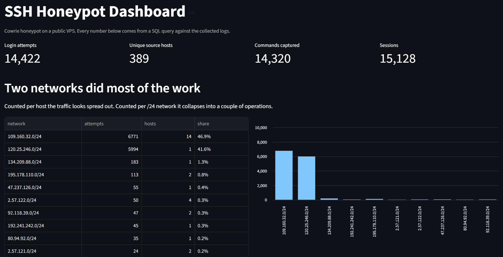
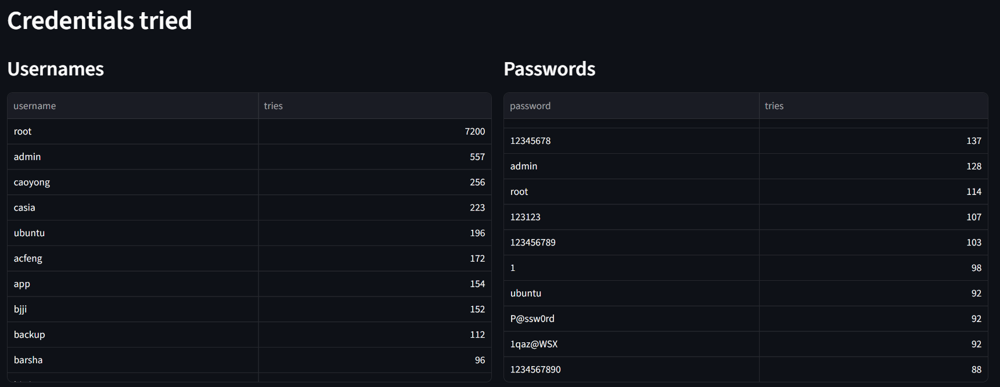

# SSH Honeypot Analysis

A Cowrie SSH honeypot on a public VPS, plus a Python tool and a SQL-backed
dashboard that turn its logs into findings about who attacks an unknown
machine, how fast, and what they do once they get in.

All data was collected first-hand from a machine I own. Strictly
observational: inbound traffic only, no scanning, no active response, no
contact with any attacker infrastructure.

## Headline numbers

Collected over 47 hours, 2026-09-08 to 2026-09-10:

|                            |                                          |
| -------------------------- | ---------------------------------------- |
| Time to first scan         | 5 min 4 sec after the host went live     |
| Login attempts             | 14,422                                   |
| Attacker commands captured | 14,320 (98% of them fingerprinting)      |
| Unique source hosts        | 624 connected, 389 attempted a login     |
| Distinct /24 networks      | 553 connected, 360 attempted a login     |

235 of the 624 hosts connected, fingerprinted the service, and left
without ever trying a password. Over a third of the traffic reaching the
port was reconnaissance rather than attack.

## Findings

### 1. 624 hosts, but two networks did 88.5% of the work

Counted per host, the traffic looks diffuse. Counted per /24, it
collapses:

| Network         | Attempts | Share |
| --------------- | -------- | ----- |
| 109.160.32.0/24 | 6,771    | 46.9% |
| 120.25.246.0/24 | 5,994    | 41.6% |
| all others      | 1,657    | 11.5% |

Fourteen hosts in `109.160.32.0/24` split that work. Eight of them
stopped at exactly 500 attempts, and two more matched each other at
exactly 784. Identical per-host totals are the signature of a controller
handing out equal shares of one job, not fourteen independent attackers.
The three smallest hosts (281, 157, and 54 attempts) were most likely
still working when collection stopped.

This is an argument against per-IP blocklists. Blocking by host treats
one operation as fourteen problems.

### 2. The largest single source was not attacking

`120.25.246.192` made 5,994 attempts, 41.6% of the total. Every one of
its sessions ran exactly one command:

```
echo -e "\x6F\x6B"
```

That decodes to `ok`. The bot checks whether the response is `ok` or the
literal string `\x6F\x6B`, which tells it whether the shell handles
escape sequences the way a real one would. It is testing for honeypots
before spending a payload.

The single biggest source of traffic to this host was reconnaissance
looking for fake targets, not an attack.

### 3. The apparent decline was one host, and the real trend is the opposite

Daily attempts fell from 9,164 to 4,628, which looks like attacker
interest decaying after a fresh IP is discovered.

That reading is wrong. 5,540 of the 6,315 attempts during the 05:00 to
07:00 window on day one came from `120.25.246.192` alone, and 92% of
that host's total activity fell inside those three hours. One job ran
once and finished.

Excluding that host:

| Day        | Attempts |
| ---------- | -------- |
| 2026-09-08 | 3,170    |
| 2026-09-09 | 4,628    |

Attack volume rose 46% from day one to day two. A new host is not
attacked hardest on arrival; it is found, catalogued, and hit harder as
more operators discover it. Day one also includes several hours before
the host was reachable at all.

Day three is excluded from the comparison because collection stopped
3 hours 46 minutes into it.

### 4. Username lists were walked alphabetically

Excluding `root`, `admin`, `ubuntu`, and `user`, the most-attempted
usernames appear in alphabetical order and stop around `d`:

```
a, acfeng, app, backup, barsha, bitrix, bjji, caoyong, casia, cbsr, deploy
```

The most common credential pair (`admin` / `admin`) appears only 30
times out of 14,422. High variety with almost no repetition means a
dictionary sweep in progress, not targeted guessing. Names like
`caoyong` and `acfeng` are real account names rather than generated
strings, so the list was built from observed accounts somewhere upstream.

Passwords were the expected weak set: `123456` (2.9%), `1234`, `123`,
`12345`, `111111`.

### 5. Almost every visitor asked what the machine was

Of the 14,320 commands captured, about 98% were fingerprinting:

| Command                    | Times |
| -------------------------- | ----- |
| `uname` in some form       | 8,094 |
| the `echo ok` check above  | 5,994 |

Before spending a payload, a bot wants to know the kernel, the
architecture, and whether the shell is real. The rest of this section
covers the roughly 229 commands that did something else.

### 6. What the malware actually did

Multi-step attacks arrived as a single long input, not a typed sequence.
Exactly one session in the whole dataset ran more than one command. The
rest piped an entire script in at once, which is why the interesting
activity hides inside a handful of very long commands.

- **One script, many networks.** An 11,956-character capability-profiling
  script ran 208 times, byte for byte identical, from hosts in unrelated
  networks. It fingerprinted CPU model, core count, and GPU presence,
  then tested whether it could write and execute a file. GPU detection
  indicates mining suitability assessment. The same toolkit is in
  circulation across separate operators.
- **Staged payload retrieval.** An 874-character script wrote its own SSH
  private key to disk, then used `scp` to pull a second stage from a
  hardcoded host, with `wget` and `curl` as fallbacks. It ran 10 times.
- **Botnet recruitment.** Two sessions dropped a binary named `sshd` and
  launched it with roughly 50 IP addresses as arguments, turning the
  host into a node attacking those targets.
- **Credential and message theft.** One session enumerated Telegram
  desktop session data, SMS gateway devices, and modem configuration
  paths.
- **Wrong-target assumptions.** One ran `/ip cloud print`, a MikroTik
  RouterOS command. The bot believed it had landed on a router.
- **Competitor checks.** Several ran `ps | grep '[Mm]iner'` before doing
  anything else, checking for rival cryptominers already installed.

One session searched for `D877F783D5D3EF8C`, a marker associated with
the Dota/Outlaw SSH botnet family.

### 7. Client tooling was almost entirely one library

| Banner                       | Sessions |
| ---------------------------- | -------- |
| SSH-2.0-Go                   | 14,590   |
| SSH-2.0-PuTTY\_Release\_0.84 | 36       |
| SSH-2.0-OpenSSH-keyscan      | 15       |
| SSH-2.0-libssh2\_1.11.1      | 14       |

A handful of connections were not SSH at all, including HTTP requests
and TLS handshakes aimed at the port. Some research scanners identified
themselves plainly (ZGrab, Nmap, Fingerprintx).

## Setup

- $6/mo Ubuntu 22.04 VPS
- Real SSH relocated to a nonstandard port, key-only auth, root password
  login disabled
- Cowrie 3.0.13 running as an unprivileged user on port 2222
- `iptables` redirects port 22 to 2222, so scanners reach the port they
  expect while the honeypot holds no privileges

## Running the analysis

```
python parse.py
```

Reads every rotated Cowrie log in `data/`, so it works unchanged as
files accumulate. A 200-line sample is committed so the tool runs on a
fresh clone.

## Dashboard

The same data, loaded into SQLite and served as an interactive dashboard.
Every number on the page comes from a SQL query, including a box for
running your own.

```
pip install -r requirements.txt
python load_db.py       # builds honeypot.db from the logs in data/
streamlit run app.py    # opens the dashboard at localhost:8501
```

`load_db.py` splits the raw events into three tables (`sessions`,
`logins`, `commands`). `queries.sql` holds the queries behind the
findings above, and `run_queries.py` prints them without starting the
dashboard.





## C++ parser

A C++ rewrite of the analysis, used to compare the two languages. The
first attempt was 1.6x slower than Python; measuring showed 98% of the
time was JSON parsing, and switching libraries made the final version
3.2x faster than Python on the same 117,248 lines. Details and build
steps in [cpp/README.md](cpp/README.md).

## Limitations

- One vantage point, one IP address, one 47-hour window. Nothing here
  generalizes to the internet as a whole.
- Cowrie accepts nearly all logins by design, so successful logins
  measure the configuration, not attacker skill. Only 22 of 14,422
  attempts were rejected.
- Two networks dominate the dataset. Most aggregate statistics describe
  those two operations more than they describe attacker behavior
  generally.
- Geolocation and network attribution reflect where infrastructure is
  hosted, not where operators are.
- Sessions are auth-layer and shell-layer only. No packet capture.

## Next

- Per-network and per-country enrichment via ASN lookup
- Detection rules for brute force bursts, password spraying, and
  credential reuse across hosts
- Extended collection through late September